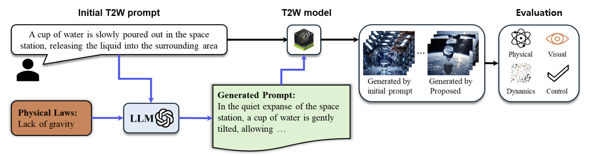
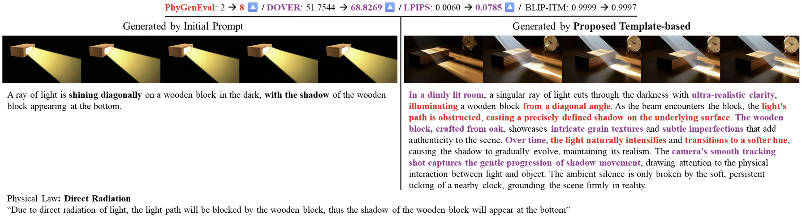

# Analyzing the Impact of Template-Based Prompting on Text-to-World Simulation Quality

## Method Overview
We design a **user-centered prompt template** for Text-to-World generation and evaluate how template factors affect overall video quality.

**Template components**
- Task Instruction
- Prompt Conditions
- Target Scene
- Prompt Style
- Query (user intent)

## Evaluation
**Model:** [COSMOS-predict2 Text2World](https://github.com/nvidia-cosmos/cosmos-predict2) (generation), GPT-4o (prompt generator)  
**Dataset:** [PhyGenBench](https://github.com/OpenGVLab/PhyGenBench) (physics commonsense scenarios)

**Metrics**
- DOVER (Perceptual Realism)
- LPIPS (Dynamics)
    - The dynamics score is computed as:

$$
\text{Dynamics}_{\text{video}}
=
\frac{1}{T-1}
\sum_{t=1}^{T-1}
\text{LPIPS}(F_t, F_{t+1})
$$

    - Given a video sequence of $T$ frames, we define the temporal dynamics score as the average LPIPS distance between consecutive frame pairs $(F_t, F_{t+1})$. Since LPIPS measures perceptual dissimilarity between two images(with lower values indicating higher similarity), larger LPIPS values correspond to greater frame-to-frame visual changes and are therefore interpreted as indicating stronger temporal dynamics.
      
- BLIP-ITM (Controllability)
- PhyGenEval (Physical Plausibility)

## Results

- **Initial prompt:** Base prompt → Text2World 
- **Proposed:** Template → GPT-4o → Text2World

### Two-Sample T-test

| Metric | N | Base Prompt | Template-based Prompt | P-value |
|:--|:--:|:--:|:--:|:--:|
| PhyGenEval (Physical Plausibility) ↑ | 93 | 4.54 | **6.47** | p < 0.001 |
| DOVER (Perceptual Realism) ↑ | 93 | 77.8 | **83.1** | p < 0.001 |
| LPIPS (Dynamics) ↑ | 93 | 0.1151 | **0.1688** | p < 0.001 |
| BLIP-ITM (Controllability) ↓ | 93 | **0.941** | 0.827 | p < 0.001 |

## Scope of This Repository

This repository focuses on analyzing the impact of **template-based prompting**
by comparing:

- **Base prompt directly applied to the Text-to-World model**, and
- **LLM-generated prompts based on structured templates**, followed by Text-to-World generation.

While preliminary experiments explored comparisons between LLM-generated base prompts and LLM-generated template prompts, those results did not show statistically significant
differences and are not included in this repository.

Accordingly, this repository presents results from the finalized experimental setting used in our reported study.

# References
We used the code from following repositories: [PhyGenBench](https://github.com/OpenGVLab/PhyGenBench), [DOVER](https://github.com/VQAssessment/DOVER), [LPIPS](https://github.com/richzhang/PerceptualSimilarity), [LAVIS](https://github.com/salesforce/LAVIS)
